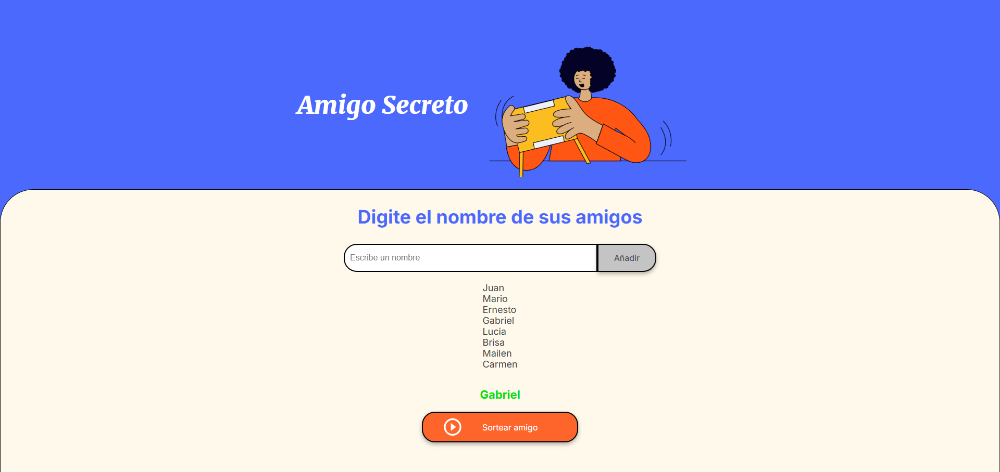

# AmigoSecreto

## 🚀 Descripción

Este proyecto es un juego interactivo donde los participantes pueden ingresar sus nombres y, a través de un sorteo aleatorio, se selecciona un **"Amigo Secreto"**.

El propósito del desafío es **desarrollar habilidades en lógica de programación**, centrándose en la implementación de **JavaScript puro (Vanilla JS)** sin preocuparse por la estructura visual, que ya está definida con HTML y CSS.

🔹 **Características principales:**
- Agregar nombres a la lista.
- Sortear aleatoriamente un amigo secreto.
- Mostrar el nombre seleccionado en pantalla.
- Deshabilitar botones tras el sorteo para evitar selecciones múltiples.

---

## 🎮 Funcionamiento

1️⃣ **El usuario ingresa nombres** en un campo de texto y los añade a la lista.  
2️⃣ **Cuando hay suficientes nombres**, el usuario hace clic en el botón "Sortear amigo".  
3️⃣ **Un nombre es seleccionado al azar** y se muestra en pantalla.  

📸 **Vista previa del proyecto:**  


---

## 📂 Estructura del Proyecto

```bash
📁 amigo-secreto/
├── 📄 index.html     # Estructura del juego
├── 📄 style.css      # Estilos del diseño
├── 📄 app.js         # Lógica en JavaScript
├── 📄 README.md      # Documentación del proyecto
├── 📂 assets/        # Imágenes y recursos
│   ├── amigo-secreto.png
│   ├── play_circle_outline.png
│   ├── muestra-proyecto.png
